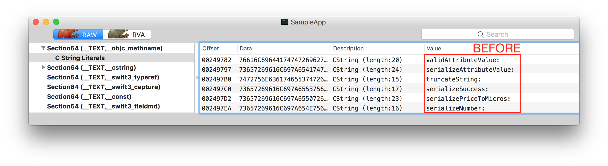
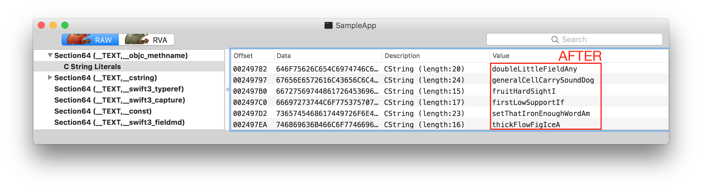
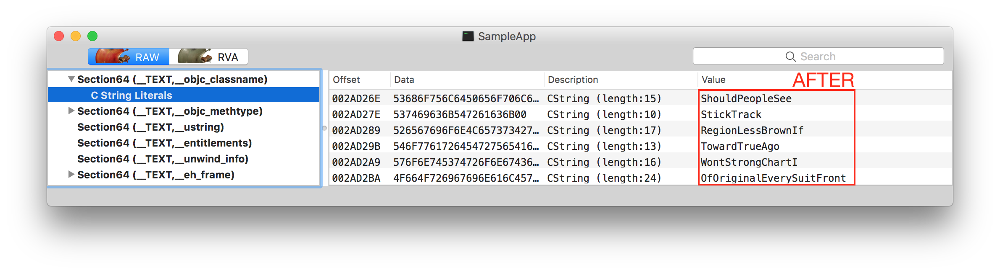

# MachObfuscator 🔏

MachObfuscator is a programming-language-agnostic [Mach-O](https://en.wikipedia.org/wiki/Mach-O) apps obfuscator (for Apple platforms).

## Current status 🏃‍♂️

✅ – means feature is completed, ❌ – means feature is todo/in-progress.

- ✅ Mach-O iOS
- ✅ Mach-O macOS
- ✅ iOS NIBs (including storyboards)
- ⚠️ macOS NIBs (including storyboards) – does not support bindings yet
- ❌ MOMs (CoreData)
- ❌ Mach-O watchOS
- ❌ Mach-O tvOS
- ❌ Bitcode
- ❌ automatic code re-signing (need to re-sign all images manually, see [resign.sh](resign.sh))

## Overview 🌍

MachObfuscator is a binary symbolic obfuscator. What does it mean? There are a few important terms:

- Obfuscator – a tool which makes software hard to be reverse engineered.
- Binary obfuscator – a type of obfuscator that operates on machine code, not on a source code.
- Symbolic obfuscator – a type of obfuscator that obfuscates only symbol names, does not change program control-flow.

MachObfuscator transforms symbols in [Mach-O](https://en.wikipedia.org/wiki/Mach-O) files directly. Mach-O format is used mainly on Apple platforms as a machine code container for executables and libraries. MachObfuscator doesn't need access to the app source code in order to obfuscate it.

## Demo 🚀

Let's see MachObfuscator obfuscating `SampleApp.app` application:

[](https://asciinema.org/a/yYFq0MCwtX9PWh89wgiuM4aXC)

Results can be seen by opening app's main executable in [MachOView](https://sourceforge.net/projects/machoview/). MachOView shows obfuscated ObjC selectors:




and obfuscated ObjC class names:



Only sample changes are shown above. MachObfuscator changes more Mach-O sections.

## Usage details 🎮

```
$ ./MachObfuscator
usage: ./MachObfuscator [-qvdhtD] [-m mangler_key] APP_BUNDLE

  Obfuscates application APP_BUNDLE in-place.

Options:
  -h, --help              help screen (this screen)
  -q, --quiet             quiet mode, no output to stdout
  -v, --verbose           verbose mode, output verbose info to stdout
  -d, --debug             debug mode, output more verbose info to stdout

  -t, --methtype          obfuscate methType section (objc/runtime.h methods may work incorrectly)
  -D, --machoview-doom    MachOViewDoom, MachOView crashes after trying to open your binary (doesn't work with caesarMangler)
  --swift-reflection      obfuscate Swift reflection sections (typeref and reflstr). May cause problems for Swift >= 4.2
  -m mangler_key,
  --mangler mangler_key   select mangler to generate obfuscated symbols


Available manglers by mangler_key:
  caesar - ROT13 all objc symbols and dyld info
  realWords - replace objc symbols with random words (dyld info obfuscation supported)
```

## Under the hood 🔧

In a great simplification, MachObfuscator:

1. looks for all executables in the app bundle,
2. searches recursively for all dependent libraries, dependencies of those libraries and so on,
3. searches for all NIB files in the app bundle,
4. discriminates obfuscable files (files in the app bundle) and unobfuscable files (files outside the app bundle),
5. collects Obj-C symbols, export tries and import lists from the whole dependency graph,
6. creates symbols whitelist and symbol blacklist (symbols used in unobfuscable files),
7. mangles whitelist symbols, export tries and import lists using selected mangler,
8. replaces symbols in obfuscable files,
9. clears sections which are optional, 
10. saves all the files at once.

MachObfuscator changes following Mach-O sections:

- `__TEXT, __objc_classname` – mangles symbol names
- `__TEXT, __objc_methname` – mangles symbol names
- `__TEXT, __objc_methtype` –  (optional, enabled with `-t` parameter) fills whole section with `0`s
- `__TEXT, __swift3_typeref`, `__TEXT, __swift4_typeref`, `__TEXT, __swift5_typeref` – fills whole section with `0`s
- `__TEXT, __swift3_reflstr` , `__TEXT, __swift4_reflstr`,  `__TEXT, __swift5_reflstr` – fills whole section with `0`s
- `LC_DYLD_INFO_ONLY` – mangles export tries and binding lists
- `LC_SYMTAB` – fills whole section with `0`s

`__TEXT, __swift*` are sections used by Swift's reflection mechanism ([`Mirror`](https://developer.apple.com/documentation/swift/mirror)). `Mirror` works even after clearing those sections, just returns less detailed data. `LC_SYMTAB` is used by `lldb`.

MachObfuscator does not affect crash symbolication because [dSYMs](https://docs.fabric.io/apple/crashlytics/missing-dsyms.html) are generated during compilation – that is before obfuscation.

## Contributing 🎁

If you have any idea for improving MachObfuscator, let's chat on Twitter ([@kam800](https://twitter.com/kam800)).

If you want to write some code, but don't feel confortable with Mach-O, I suggest doing some preparations first:

1. Play with [MachOView](https://sourceforge.net/projects/machoview/), open some binaries and try to feel Mach-O layout.
2. Read `/usr/include/mach-o/loader.h` from any macOS.
3. Read `Mach+Loading.swift` from MachObfuscator repo.

## License 👍

This project is licensed under the MIT License - see the [LICENSE](LICENSE) file for details.
